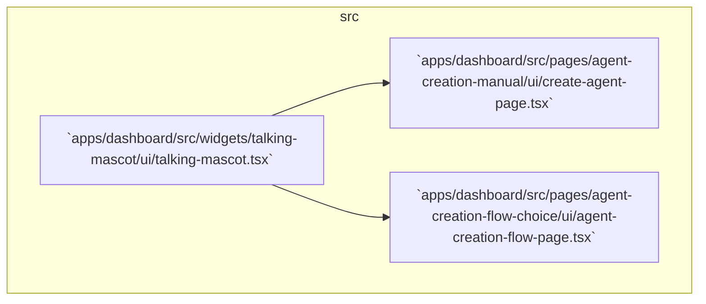

# Talking Mascot Component Plan

This document outlines the steps to extract the mascot speech bubble into a reusable `talking-mascot` widget and integrate it into existing pages.



## Steps

1. Create [`apps/dashboard/src/widgets/talking-mascot/ui/talking-mascot.tsx`](apps/dashboard/src/widgets/talking-mascot/ui/talking-mascot.tsx:1)  
   - Props:  
     - `message: string`  
   - Imports:  
     - `mascot` from `@packages/brand/logo.svg`  
     - `Typewriter` from [`apps/dashboard/src/pages/agent-creation-manual/ui/typewriter.tsx`](apps/dashboard/src/pages/agent-creation-manual/ui/typewriter.tsx:1)  
   - Renders:
     ```tsx
     <div className="flex items-start gap-4 w-full" id="mascot-speech">
       <div className="flex-shrink-0">
         
       </div>
       <div className="flex-1 px-4 py-2 bg-accent rounded-2xl shadow-lg border border-primary transition-all duration-300 ease-in-out">
         <Typewriter message={message} />
       </div>
     </div>
     ```

2. Modify [`apps/dashboard/src/pages/agent-creation-manual/ui/create-agent-page.tsx`](apps/dashboard/src/pages/agent-creation-manual/ui/create-agent-page.tsx:54)  
   - Import `TalkingMascot` from [`apps/dashboard/src/widgets/talking-mascot/ui/talking-mascot.tsx`](apps/dashboard/src/widgets/talking-mascot/ui/talking-mascot.tsx:1)  
   - Replace the existing mascot `<div id="mascot-speech">…</div>` block with:
     ```tsx
     <TalkingMascot message={getMascotMessage(methods.current.id)} />
     ```

3. Modify [`apps/dashboard/src/pages/agent-creation-flow-choice/ui/agent-creation-flow-page.tsx`](apps/dashboard/src/pages/agent-creation-flow-choice/ui/agent-creation-flow-page.tsx:55)  
   - Import `TalkingMascot` from [`apps/dashboard/src/widgets/talking-mascot/ui/talking-mascot.tsx`](apps/dashboard/src/widgets/talking-mascot/ui/talking-mascot.tsx:1)  
   - Replace the existing mascot speech bubble `<div id="mascot-speech">…</div>` with:
     ```tsx
     <TalkingMascot message="Welcome! Let’s create your perfect content agent. Choose how you’d like to set it up below.">
       <Button onClick={startTutorial} size="sm" variant="ghost">
         💡 Get help choosing
       </Button>
     </TalkingMascot>
     ```

After implementing these changes, the `TalkingMascot` component will centralize mascot UI and messaging across the dashboard.